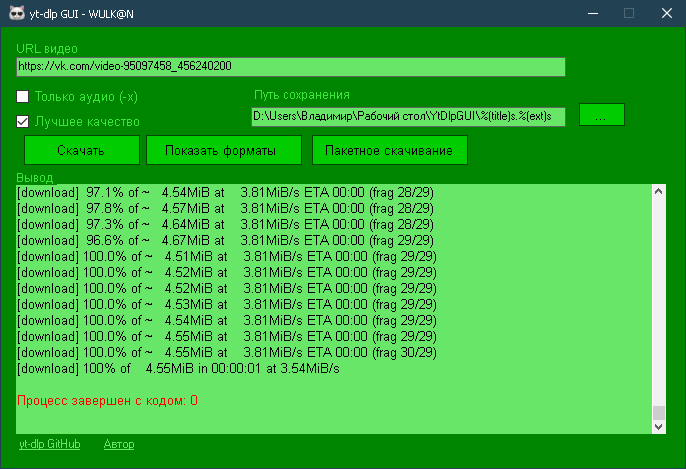

# 🎬 YtDlpGUI - Графическая оболочка для yt-dlp

[](https://github.com/wulkan-Git/YtDlpGUI/actions)
[](https://github.com/wulkan-Git/YtDlpGUI/releases)
[](https://opensource.org/licenses/MIT)

[](https://github.com/wulkan-Git/YtDlpGUI/releases)

**YtDlpGUI** - это удобная графическая оболочка для популярной консольной утилиты `yt-dlp.exe`, позволяющая скачивать видео и аудио с различных интернет-ресурсов без использования командной строки.

 <!-- Замените на реальный путь к скриншоту -->

## 🌟 Основные возможности

- 📥 **Скачивание видео/плейлистов** по прямой ссылке
- 📁 **Указание папки для сохранения** с помощью диалога выбора
- 🔊 **Извлечение аудиодорожки** из видеофайлов
- 🏆 **Скачивание в лучшем качестве** с автоматическим объединением видео и аудио
- 📊 **Просмотр доступных форматов** для конкретного видео
- 📚 **Пакетное скачивание** из файла со списком URL
- 🎨 **Цветной вывод логов**:
  - Стандартный вывод - черный
  - Ошибки - красный
  - Успех - зеленый

## ⚙️ Особенности реализации

- **Полностью асинхронная работа** без блокировки интерфейса
- **Автоматическая проверка** наличия yt-dlp.exe при запуске
- **Поддержка UTF-8** для корректного отображения вывода
- **Автоматическая прокрутка логов** к новым сообщениям
- **Интегрированные ссылки** на GitHub yt-dlp и сайт автора
- **Обработка ошибок** с выводом в лог программы

## 🚀 Как использовать

1. Скачайте последнюю версию программы из раздела [Releases](https://github.com/wulkan-Git/YtDlpGUI/releases)
2. Распакуйте архив в любую папку
3. Запустите `YtDlpGUI.exe`
4. Вставьте ссылку на видео или плейлист в поле "URL"
5. Выберите параметры скачивания:
   - Формат (видео/аудио)
   - Качество
   - Папку для сохранения
6. Нажмите "Старт" для начала загрузки

## 📦 Требования

- **Операционная система**: Windows 7 или новее
- **.NET Framework**: 4.7.2 или выше
- **yt-dlp**: Автоматически скачивается при первом запуске

## 🔧 Для разработчиков

```bash
# Клонировать репозиторий
git clone https://github.com/wulkan-Git/YtDlpGUI.git

# Открыть решение в Visual Studio
YtDlpGUI.sln
